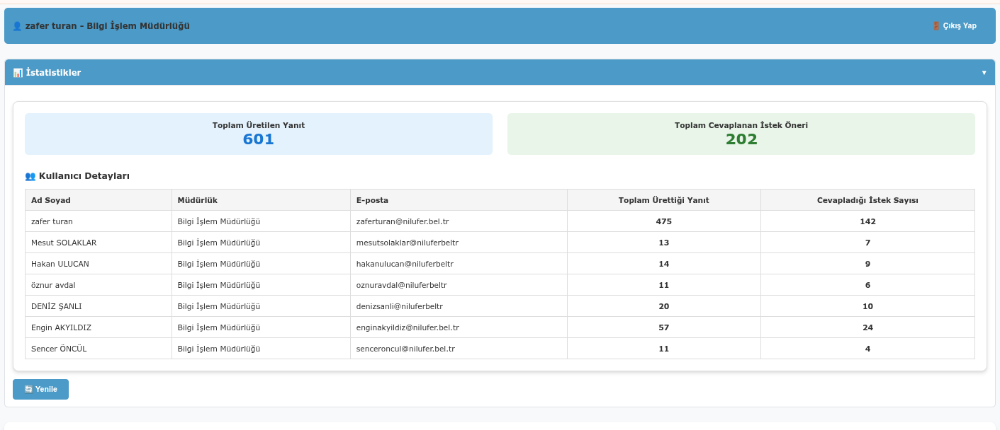

# 🤖 AI Helper

Vatandaş taleplerine cevaplarınızı hazırlayın. İstek ve önerilere uygun, resmi ve anlaşılır cevaplar oluşturun.

## 📸 Ekran Görüntüleri

### Ana Uygulama Arayüzü


### İstatistikler ve Yanıt Geçmişi


## ✨ Özellikler

- **AI Destekli Metin Düzenleme**: Ollama LLM modelleri ile metinleri daha kibar ve anlaşılır hale getirin
- **Dinamik Model Seçimi**: Ollama'dan mevcut modelleri otomatik olarak alır
- **İki Farklı Mod**: 
  - İstek/öneri metninden cevap üretme
  - Kendi yazdığınız cevabı iyileştirme
- **Gerçek Zamanlı İstatistikler**: Üretim süresi, model adı, karakter sayısı
- **Veritabanı Entegrasyonu**: Tüm istekler ve yanıtlar SQLite'da saklanır
- **İki Sütunlu Modern Layout**: Sol sütunda giriş, sağ sütunda yanıtlar
- **Yanıt Geçmişi**: Önceki yanıtları görüntüleme ve seçme
- **Panoya Kopyalama**: JavaScript ile tek tıkla yanıt kopyalama
- **Yanıt Seçimi Takibi**: Hangi yanıtların seçildiğini veritabanında saklama
- **LLM Parametre Kontrolü**: Temperature, Top-p, Repetition Penalty ayarları
- **Tooltip Desteği**: Parametreler hakkında açıklayıcı bilgiler
- **Güvenli Authentication**: Magic Link + OTP ile giriş sistemi
- **Domain Kısıtlaması**: Sadece @nilufer.bel.tr e-posta adresleri
- **Profil Yönetimi**: Ad soyad ve müdürlük bilgileri
- **Rate Limiting**: Brute force koruması ve günlük limitler
- **Modern UI/UX**: Gelişmiş gölge efektleri ve responsive tasarım
- **Docker Compose Deployment**: Kolay kurulum ve deployment

## 🛠️ Teknolojiler

### Backend
- **FastAPI**: Modern Python web framework
- **SQLAlchemy**: ORM ile veritabanı yönetimi
- **SQLite**: Ana veritabanı (production-ready)
- **Ollama**: Yerel LLM entegrasyonu
- **Pydantic**: Veri doğrulama ve serileştirme
- **Gemini API**: Google Gemini modelleri entegrasyonu
- **JWT**: JSON Web Token authentication
- **SMTP**: E-posta gönderimi (Google Workspace)
- **Rate Limiting**: Brute force koruması

### Frontend
- **HTML/CSS/JavaScript**: Modern web teknolojileri
- **Nginx**: Static file serving ve reverse proxy
- **Responsive Design**: Mobil ve masaüstü uyumlu
- **Modern UI**: Temiz ve kullanıcı dostu arayüz
- **JavaScript Integration**: Panoya kopyalama için client-side script
- **CSS Styling**: Özel tasarım ve gölge efektleri

### Deployment
- **Docker**: Containerization
- **Docker Volumes**: Persistent data storage
- **Nginx**: Frontend serving ve API proxy
- **Cloudflare**: Production URL routing

## 📋 Gereksinimler

- Docker
- Python 3.11+ (development için)
- SQLite (production'da otomatik)

## 🚀 Kurulum

### 🐳 Docker ile Hızlı Kurulum (Önerilen)

1. **Projeyi Klonlayın**
```bash
git clone <repository-url>
cd ai_helper
```

2. **Docker Volumes Oluşturun**
```bash
docker volume create ai_helper_data
docker volume create ai_helper_logs
```

3. **Ortam Değişkenlerini Ayarlayın**
`.env` dosyası oluşturun ve `ai_helper_data` volume'una kopyalayın:
```env
# Database Configuration
DATABASE_URL=sqlite:///./data/ai_helper.db

# Ollama Configuration
OLLAMA_HOST=http://localhost:11434

# Authentication Configuration
JWT_SECRET_KEY=your-super-secret-jwt-key
JWT_ALGORITHM=HS256
ACCESS_TOKEN_EXPIRE_MINUTES=720

# SMTP Configuration (Google Workspace)
SMTP_HOST=smtp.gmail.com
SMTP_PORT=587
SMTP_USERNAME=your-email@niluferyapayzeka.tr
SMTP_PASSWORD=your-app-password
SENDER_EMAIL=yonetici@niluferyapayzeka.tr

# Gemini API Configuration
GEMINI_API_KEY=your-gemini-api-key

# Production URLs
PRODUCTION_URL=https://yardimci.niluferyapayzeka.tr
FRONTEND_URL=https://yardimci.niluferyapayzeka.tr
BACKEND_URL=https://yardimci.niluferyapayzeka.tr/api/v1
```

4. **Docker Image Build Edin ve Container'ı Çalıştırın**
```bash
docker build -t ai_helper_v3 .
docker run -d --name ai_yardimci --restart always \
  -p 8500:80 -p 8000:8000 \
  -v ai_helper_data:/app/data \
  -v ai_helper_logs:/app/logs \
  ai_helper_v3
```

5. **Uygulamaya Erişin**
- **Frontend**: https://yardimci.niluferyapayzeka.tr/
- **Backend API**: https://yardimci.niluferyapayzeka.tr/api/v1/
- **Health Check**: https://yardimci.niluferyapayzeka.tr/api/v1/auth/health

> **Not**: Detaylı Docker kurulum bilgileri için [DOCKER_SETUP.md](./DOCKER_SETUP.md) dosyasına bakın.

### 🔧 Geliştirme Ortamı Kurulumu

1. **Sanal Ortam Oluşturun**
```bash
python -m venv venv
source venv/bin/activate  # Linux/Mac
# veya
venv\Scripts\activate  # Windows
```

2. **Bağımlılıkları Yükleyin**
```bash
pip install -r requirements.txt
```

3. **Backend'i Başlatın**
```bash
python main.py
```
Backend `http://localhost:8000` adresinde çalışacak.

4. **Frontend'i Başlatın**
```bash
# Nginx ile frontend serve etmek için
nginx -c /path/to/nginx.conf

# Veya development için basit HTTP server
python -m http.server 8500 --directory frontend/
```
Frontend `http://localhost:8500` adresinde çalışacak.

## 📖 Kullanım

### Ana Özellikler

1. **İstek/Öneri Metninden Cevap Üretme**:
   - Sol sütunda metin girişi yapın
   - Yanıt ayarlarını düzenleyin (Temperature, Top-p, Repetition Penalty)
   - Model seçin (Gemini veya Ollama)
   - "🚀 Yanıt Üret" butonuna tıklayın

2. **Kendi Cevabınızı İyileştirme**:
   - Sol sütunda kendi yazdığınız cevabı girin
   - "🚀 Yanıt Üret" butonuna tıklayın
   - AI metni daha kibar ve resmi hale getirecek

3. **Yanıt Geçmişi ve Seçimi**:
   - Sağ sütunda en son yanıtı görüntüleyin
   - "📋 Seç ve Kopyala" ile yanıtı panoya kopyalayın
   - Önceki yanıtları expander'larda görüntüleyin
   - Her yanıt için ayrı "📋 Seç ve Kopyala" butonu

### API Endpoints

#### Authentication
- `POST /api/v1/auth/request-magic-link`: Magic link ve OTP isteği
- `POST /api/v1/auth/verify-otp`: OTP doğrulama
- `GET /api/v1/auth/verify-magic-link`: Magic link doğrulama
- `GET /api/v1/auth/profile`: Kullanıcı profili
- `POST /api/v1/auth/complete-profile`: Profil tamamlama
- `POST /api/v1/auth/logout`: Çıkış yapma

#### Core API
- `GET /api/v1/models`: Mevcut modelleri listele
- `POST /api/v1/requests`: Yeni istek oluştur
- `POST /api/v1/generate`: AI yanıtı üret
- `POST /api/v1/responses/feedback`: Yanıt geri bildirimi

## 📁 Proje Yapısı

```
ai_helper/
├── frontend/             # Frontend dosyaları
│   ├── index.html       # Ana HTML dosyası
│   ├── app.js           # JavaScript logic
│   └── style.css        # CSS stilleri
├── main.py              # FastAPI backend
├── config.py            # Konfigürasyon
├── connection.py        # Veritabanı bağlantısı
├── models.py            # SQLAlchemy modelleri
├── api_models.py        # Pydantic modelleri
├── endpoints.py         # API endpoint'leri
├── auth_endpoints.py    # Authentication endpoints
├── auth_system.py       # Authentication logic
├── ollama_client.py     # Ollama entegrasyonu
├── gemini_client.py     # Gemini API entegrasyonu
├── requirements.txt     # Python bağımlılıkları
├── Dockerfile           # Docker container build
├── nginx.conf           # Nginx konfigürasyonu
├── start.sh             # Container startup script
├── .env                 # Ortam değişkenleri
├── .gitignore          # Git ignore kuralları
├── README.md            # Bu dosya
├── ROADMAP.md           # Geliştirme yol haritası
├── DOCKER_SETUP.md      # Docker kurulum rehberi
├── ekran 1.png          # Ana uygulama ekran görüntüsü
└── istatistikler.png    # İstatistikler ekran görüntüsü
```

## 🎯 Özellikler

### Backend Özellikleri
- ✅ FastAPI ile modern REST API
- ✅ SQLAlchemy ORM ile veritabanı yönetimi
- ✅ Ollama entegrasyonu
- ✅ Gemini API entegrasyonu
- ✅ Pydantic ile veri doğrulama
- ✅ Asenkron HTTP istekleri
- ✅ Hata yönetimi ve logging
- ✅ LLM parametre kontrolü (Temperature, Top-p, Repetition Penalty)
- ✅ JWT tabanlı authentication sistemi
- ✅ Magic Link + OTP giriş yöntemi
- ✅ Domain kısıtlaması (@nilufer.bel.tr)
- ✅ Rate limiting ve brute force koruması
- ✅ SMTP entegrasyonu (Google Workspace)
- ✅ Login attempt logging
- ✅ Session yönetimi (19:00'a kadar geçerli)

### Frontend Özellikleri
- ✅ HTML/CSS/JavaScript ile modern web arayüzü
- ✅ Nginx ile static file serving
- ✅ İki sütunlu responsive layout
- ✅ Dinamik model seçimi (Gemini + Ollama)
- ✅ Gerçek zamanlı yanıt üretimi
- ✅ İstatistik gösterimi
- ✅ Yanıt geçmişi ve expander'lar
- ✅ JavaScript ile panoya kopyalama
- ✅ Yanıt seçimi ve veritabanı takibi
- ✅ Tooltip desteği (parametre açıklamaları)
- ✅ Modern CSS tasarım ve gölge efektleri
- ✅ Authentication sistemi (Magic Link + OTP)
- ✅ Profil tamamlama sayfası
- ✅ Domain kontrolü (@nilufer.bel.tr)
- ✅ Responsive tasarım ve modern UI
- ✅ Gelişmiş gölge efektleri (çoklu gölge sistemi)
- ✅ Hover animasyonları ve geçiş efektleri

### Deployment Özellikleri
- ✅ Docker containerization
- ✅ Docker volumes ile persistent data storage
- ✅ Nginx ile frontend serving ve API proxy
- ✅ Health checks ve monitoring
- ✅ Production-ready configuration
- ✅ Cloudflare integration
- ✅ Automatic restart policy

## 🔧 Geliştirme

### Docker ile Geliştirme
```bash
# Container'ı başlat
docker run -d --name ai_yardimci --restart always \
  -p 8500:80 -p 8000:8000 \
  -v ai_helper_data:/app/data \
  -v ai_helper_logs:/app/logs \
  ai_helper_v3

# Logları izle
docker logs -f ai_yardimci

# Container'a bağlan
docker exec -it ai_yardimci bash

# Container'ı durdur
docker stop ai_yardimci
docker rm ai_yardimci
```

### Yerel Geliştirme
```bash
# Backend'i geliştirme modunda başlat
uvicorn main:app --reload --host 0.0.0.0 --port 8000

# Frontend'i geliştirme modunda başlat
python -m http.server 8500 --directory frontend/
```

### Veritabanı İşlemleri
```bash
# Container içinde veritabanını kontrol et
docker exec ai_yardimci python -c "import sqlite3; conn = sqlite3.connect('/app/data/ai_helper.db'); cursor = conn.cursor(); cursor.execute('SELECT COUNT(*) FROM users'); print(f'Users: {cursor.fetchone()[0]}'); conn.close()"
```

## 📊 Veritabanı Şeması

### Users Tablosu
- `id`: Birincil anahtar
- `email`: E-posta adresi (unique, @nilufer.bel.tr)
- `full_name`: Ad soyad
- `department`: Müdürlük bilgisi
- `is_active`: Aktif kullanıcı durumu
- `created_at`: Oluşturulma tarihi
- `last_login`: Son giriş tarihi
- `profile_completed`: Profil tamamlanma durumu
- `is_admin`: Admin yetkisi

### LoginTokens Tablosu
- `id`: Birincil anahtar
- `user_id`: Kullanıcı referansı
- `token`: JWT token
- `otp_code`: 6 haneli OTP kodu
- `is_used`: Kullanım durumu
- `expires_at`: Son kullanım tarihi
- `created_at`: Oluşturulma tarihi

### LoginAttempts Tablosu
- `id`: Birincil anahtar
- `user_id`: Kullanıcı referansı
- `email`: E-posta adresi
- `ip_address`: IP adresi
- `success`: Başarı durumu
- `method`: Giriş yöntemi (magic_link, otp)
- `timestamp`: Zaman damgası

### Requests Tablosu
- `id`: Birincil anahtar
- `user_id`: Kullanıcı referansı
- `original_text`: Orijinal metin
- `response_type`: Yanıt tipi (positive/negative/informative/other)
- `created_at`: Oluşturulma tarihi
- `is_active`: Aktif durum
- `remaining_responses`: Kalan yanıt sayısı
- `is_new_request`: Yeni istek durumu

### Responses Tablosu
- `id`: Birincil anahtar
- `request_id`: İstek referansı
- `model_name`: Kullanılan model
- `response_text`: AI yanıtı
- `temperature`: Temperature parametresi
- `top_p`: Top-p parametresi
- `repetition_penalty`: Repetition penalty parametresi
- `latency_ms`: Üretim süresi
- `is_selected`: Seçilme durumu
- `copied`: Kopyalanma durumu
- `created_at`: Oluşturulma tarihi
- `tokens_used`: Kullanılan token sayısı

### Models Tablosu
- `id`: Birincil anahtar
- `name`: Model adı
- `display_name`: Görünen ad
- `supports_embedding`: Embedding desteği
- `supports_chat`: Chat desteği

## 🚀 Deployment

### Production Ortamı
1. **Docker**: Single container deployment
2. **Database**: SQLite with Docker volumes persistence
3. **Frontend**: Nginx (port 80)
4. **Backend**: FastAPI (port 8000)
5. **Cloudflare**: Production URL routing

### Docker Commands
```bash
# Production deployment
docker build -t ai_helper_v3 .
docker run -d --name ai_yardimci --restart always \
  -p 8500:80 -p 8000:8000 \
  -v ai_helper_data:/app/data \
  -v ai_helper_logs:/app/logs \
  ai_helper_v3

# Logları izle
docker logs -f ai_yardimci

# Container durumunu kontrol et
docker ps

# Health check
curl https://yardimci.niluferyapayzeka.tr/api/v1/auth/health

# Container'ı yeniden başlat
docker restart ai_yardimci

# Container'ı durdur
docker stop ai_yardimci
docker rm ai_yardimci
```

### Environment Variables
```bash
# Production environment
APP_ENV=production
DEBUG_MODE=false
LOG_LEVEL=INFO
API_PORT=8000
WEB_PORT=80
DATABASE_URL=sqlite:///./data/ai_helper.db
ALLOWED_ORIGINS=https://yardimci.niluferyapayzeka.tr
```

## 🤝 Katkıda Bulunma

1. Fork yapın
2. Feature branch oluşturun (`git checkout -b feature/amazing-feature`)
3. Commit yapın (`git commit -m 'Add amazing feature'`)
4. Push yapın (`git push origin feature/amazing-feature`)
5. Pull Request oluşturun

## 📝 Lisans

Bu proje MIT lisansı altında lisanslanmıştır.

## 📞 İletişim

* **Proje Sahibi**: Zafer TURAN
* **E-posta**: zaferturan@gmail.com
* **GitHub**: @Zaferturan
* **Issues**: GitHub Issues

## 🔄 Güncellemeler

### v1.8.0 - Docker Single Container Deployment
- ✅ Docker single container deployment
- ✅ Docker volumes ile persistent data storage
- ✅ Nginx ile frontend serving ve API proxy
- ✅ Production-ready containerization
- ✅ Health checks ve monitoring
- ✅ Cloudflare integration
- ✅ Automatic restart policy
- ✅ Environment variable management
- ✅ Modern HTML/CSS/JavaScript frontend

### v1.6.0
- ✅ JWT tabanlı authentication sistemi
- ✅ Magic Link + OTP giriş yöntemi
- ✅ Domain kısıtlaması (@nilufer.bel.tr)
- ✅ Profil yönetimi (ad soyad, müdürlük)
- ✅ Rate limiting ve brute force koruması
- ✅ SMTP entegrasyonu (Google Workspace)
- ✅ Login attempt logging
- ✅ Session yönetimi (19:00'a kadar geçerli)
- ✅ Production URL desteği (Cloudflare Tunnel)
- ✅ Modern UI/UX ve gelişmiş gölge efektleri

### v1.5.0
- ✅ Authentication sistemi entegrasyonu
- ✅ Kullanıcı profil yönetimi
- ✅ Güvenlik önlemleri ve rate limiting
- ✅ E-posta gönderim sistemi

### v1.4.0
- ✅ İki sütunlu modern layout
- ✅ Yanıt geçmişi ve expander'lar
- ✅ JavaScript ile panoya kopyalama
- ✅ Yanıt seçimi veritabanı takibi
- ✅ LLM parametre kontrolü (Temperature, Top-p, Repetition Penalty)
- ✅ Tooltip desteği
- ✅ Modern CSS tasarım

### v1.3.0
- ✅ Gemini API entegrasyonu
- ✅ Çoklu model desteği (Gemini + Ollama)
- ✅ Model filtreleme ve varsayılan seçim
- ✅ Sistem prompt yönetimi
- ✅ Token limit optimizasyonu

### v1.2.0
- ✅ Docker containerization
- ✅ Always restart policy
- ✅ Varsayılan ayarlar güncellendi
- ✅ Environment variables düzeltildi

### v1.1.0
- ✅ Ollama entegrasyonu
- ✅ Çoklu model desteği
- ✅ Gelişmiş model seçimi

### v1.0.0
- ✅ Temel FastAPI backend
- ✅ Streamlit frontend
- ✅ Ollama entegrasyonu
- ✅ SQLite veritabanı
- ✅ İki farklı kullanım modu

### Gelecek Sürümler
- 🔄 CI/CD pipeline
- 🔄 Advanced monitoring
- 🔄 Multi-language support
- 🔄 API rate limiting

---

**AI Helper** - Vatandaş taleplerine profesyonel cevaplar hazırlayın! 🤖 